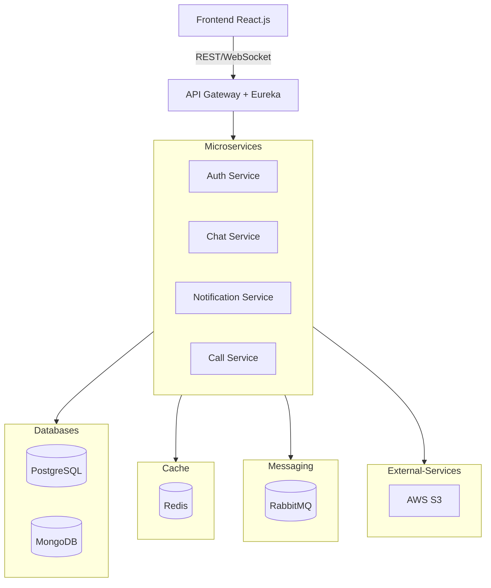

# Chatty

## Software Specification Document

**February 27, 2025**

**Authors:**  
Revazi Gelenidze | Murmani Akhaladze

**Contact:**  
📧 [gelenidze.revazi@kiu.edu.ge](mailto:gelenidze.revazi@kiu.edu.ge)  
📧 [akhaladze.murmani@kiu.edu.ge](mailto:akhaladze.murmani@kiu.edu.ge)

## **Table of Contents**

1. [Introduction](#introduction)
    
    - [1.1 Purpose](#11-purpose)
    - [1.2 Scope](#12-scope)
2. [System Overview](#system-overview)
    
    - [2.1 System Context](#21-system-context)
    - [2.2 High-Level Architecture](#22-high-level-architecture)
    - [2.3 Core Components & Their Roles](#23-core-components--their-roles)
3. [Functional Requirements](#functional-requirements)
    
    - [3.1 Authentication & Authorization](#31-authentication--authorization)
    - [3.2 User Management](#32-user-management)
    - [3.3 Chat Functionality](#33-chat-functionality)
    - [3.4 E2E Communication](#34-e2e-communication)
    - [3.5 Notifications](#35-notifications)
    - [3.6 Call Functionality](#36-call-functionality)
4. [Non-Functional Requirements](#non-functional-requirements)
    
    - [4.1 Scalability](#41-scalability)
    - [4.2 Security](#42-security)
    - [4.3 Maintainability & Extensibility](#43-maintainability--extensibility)
    - [4.4 Reliability & Fault Tolerance](#44-reliability--fault-tolerance)
    - [4.5 Logging & Monitoring](#45-logging--monitoring)
    - [4.6 Compliance & Privacy](#46-compliance--privacy)
    - [4.7 Usability & Accessibility](#47-usability--accessibility)
    - [4.8 Deployment & CI/CD](#48-deployment--cicd)
5. [System Architecture](#system-architecture)
    
6. [API Design](#api-design)
    
7. [Message Queue](#message-queue)
    
8. [Deployment Strategy](#deployment-strategy)
    
9. [Appendix](#appendix)
    
    - [9.1 Definitions & Acronyms](#91-definitions--acronyms)
    - [9.2 References](#92-references)

---

## **1. Introduction**

**The goal** is to develop a **chat messaging web application**. The application is intended to be **publicly deployed**, allowing users to sign up and use it for **end-to-end (E2E) encrypted messaging and video/audio calls** as a **casual
chat application**.

### **1.1 Purpose**

The purpose of this document is to define the **technical and functional specifications** for the chat messaging web application. It serves as a **guideline for developers** to ensure proper implementation, scalability, and security with
a planned roadmap.

This document aims to:

- Define the **core functionalities** (messaging, video/audio calls, authentication).
- Provide a **detailed system architecture** with microservices, APIs, and database structures.
- Outline **security measures**, including **end-to-end encryption** for private communication.
- Specify the **non-functional requirements** such as performance, availability, and scalability.
- Detail the **deployment strategy** for **cloud hosting** and **CI/CD automation**.

### **1.2 Scope**

The chat application will provide the following core functionalities:

#### **User Authentication & Authorization**

- JWT-based authentication with **Google OAuth2 integration**.
- Secure account creation and login with **email verification**.

#### **Real-time Messaging**

- One-to-one and group chats with **end-to-end encryption (E2EE)**.
- Message persistence using **PostgreSQL (users) & MongoDB (messages)**.

#### **Voice & Video Calls**

- **WebRTC-based** peer-to-peer (P2P) and server-relayed calls.
- **Multi-user conference support**.

#### **Multimedia Sharing**

- Users can send **images, videos, and files** in chats.
- **Cloud-based media storage integration**.

#### **Notification System**

- **Push notifications** for new messages and call invites.
- **Email notifications** for user engagement.

---

## **2. System Overview**

### **2.1 System Context**

The chat application is a **publicly deployed, real-time messaging platform** that allows users to **communicate securely** using **E2E-encrypted messaging, voice, and video calls**. It operates in a **microservices architecture**, with independent services handling authentication, messaging, media storage, and notifications.

### 2.2 **High-Level Architecture**

As for decoupling responsibilities and making it scalable, chosen architecture style is **Microservices**. We have Primary mediator of Spring Cloud API Gateway, delegating requests to microservices connected via Eureka Service registration.

The system consists of:

- **React.js Frontend** – Provides the user interface for chat, calls, and notifications.
- **Spring Boot Backend** – Manages authentication, chat processing, and notification handling.
- **Databases:**
  - **PostgreSQL** – Stores user accounts and relationships.
  - **MongoDB** – Stores chat history and saved notifications.
- **RabbitMQ** – Handles asynchronous messaging for **emails & notifications.
- **Redis** – Caches frequently accessed and **“hot data”** to improve performance.

### **2.3 Core Components & Their Roles**

#### **Frontend: React.js App**
- Provides a responsive **UI** for using whole application.
- Communicates with the backend using **REST APIs** and **WebSockets** for real-time updates.

#### **Auth Service**
- Manages **JWT-based authentication** and **Google OAuth2 login**.
- Handles **user account management**, including **CRUD operations for user entities**.
- Interacts with **PostgreSQL** for storing user profiles and authentication data.

#### **Chat Service**
- Handles **real-time messaging, group chats, and chat management**.
- Directly interacts with **MongoDB** to store **chat messages and conversation history**.
- Supports **message encryption** for end-to-end security.

#### **Notification Service**
- Consumes messages from **RabbitMQ queues** to handle:
  - **Push notifications** for new messages and events via **WebSockets**.
  - **Email notifications** via **Google SMTP** for account-related actions.

#### **Call Service**
- Microservice responsible for **WebRTC-based audio/video calls** with **screen sharing**.
- Manages **peer-to-peer signaling** and **TURN/STUN server integration**.
- Ensures **secure and encrypted** communication using **DTLS-SRTP**.

#### **Databases**
- **PostgreSQL**
  - Contains two schemas:
    1. **Auth Service Schema** – Stores user authentication & profile data.
    2. **Chat Service Schema** – Manages **relational chat data** (friendships, requests, blocks).
  
- **MongoDB**
  - Stores two major collections:
    1. **Chat Service Collections** – Persists chat messages and conversation metadata.
    2. **Notification Service Collections** – Saves push/email notification logs.

#### **Cache: Redis**
- Caches **frequently accessed profile data** to reduce database queries.
- Stores **user online status** and **active session information** for real-time updates.

#### **Messaging: RabbitMQ**
- Manages **asynchronous messaging** with two queues:
  - **Email Queue** – Processes and sends user emails.
  - **Push Notification Queue** – Handles mobile and web push notifications.
#### **AWS S3**
- Cloud-based **file storage system** for:
  - **Chat attachments** (images, videos, files).
  - **Profile pictures** and other **user-uploaded media**

---
# **3. Functional Requirements**

## **/FR1/ Authentication & Authorization**

**Description:** Users must be able to securely authenticate and authorize access to the system using **JWT-based authentication** or **Google OAuth2**.

---

### **/FR1.1/ User Login**

**Description:** Users must be able to log in using **email/username and password**

- **Precondition:**  
	- User **must exist** in the database.
	- User **must have verified their email** (`isActive=true`).  

- **Postcondition:** 
	- User receives a **JWT token** pair (access/refresh) for authentication.  
	- Session details are cached in **Redis**.

- **Edge Case:**
	- If user is not activated, login is denied and verification email is sent. User is redirected to notification page that activation email is sent

---

### **/FR1.2/ Google OAuth2 Authentication**

**Description:** Users must be able to authenticate using **Google OAuth2** (Sign in or Sign up if they are first time users).

- **Precondition:**  
  - User must have a valid **Google account**.  

- **Postcondition:**  
  - After successfull login with google, OAuth2 token is forwarded to backend, exchanging it with user information with Google API (profile and email scope).  
  - If user is recorded in database, JWT token pair is returned for further activity, 
  - Else they redirect to the partial registration for providing additional profile info (username, dob, etc). User is stored with isActive false till they fullfill their profile

---

### **/FR1.3/ JWT Token  Refresh**

**Description:** Users can renew their access tokens with refresh token.

- **Precondition:**  User must provide valid refresh token.
- **Postcondition:**  User gets a new access token.

---

## **/FR2/ User Management**
**Description:** Users should be able to register and manage their **credentials/profile information**.

### **/FR2.1/ User Registration**
**Description:** Users must be able to create an account with **email, username, password, and profile-related fields**.

- **Precondition:**  
  - Email and username **must be unique** (not used before).  
  - Fields must comply with **backend validation** (e.g., strong password policy).  

- **Postcondition:**  
  - User is stored in **PostgreSQL** with `isActive=false`.  
  - A **verification email** is sent.

### **/FR2.2/ User Partial Registration (OAuth2)**
**Description:** Registration should also support partial registration for OAuth2 landed users needing to provide only extra fields (e.g. username, dob, etc)

- **Precondition:**  
	- User passed google OAuth succesfully and was redirected to partial registration form. Where they submitted the data from.
	- Submitted data must satisfy validation rules.

- **Postcondition:**  
	- User is updated with fullfiling information.
	- isActive flag is set to true.

### **/FR2.3/ Password Reset**
**Description**: Users must be an able to reset forgotten password.

- **Precondition:** User **requests a password reset**, providing password as confirmation.

- **Postcondition:** 
	- A **temporary URL with reset token** is emailed, allowing password change.
	- After filling the form on frontend with newPassword. It is submitted back to the backend with email sent token included

### **/FR2.4/ Access Profile Information**
**Description:** Users can access their profile information on their profile page.

- **Precondition:** User must be **logged in**.  
- **Postcondition:** User retrieves their **profile information**.

### **/FR2.5/ Profile Update**
**Description**: Users can partially or fully update their profile information (not auth related from there)

- **Precondition:** User **submits updated profile data** (partial update is allowed).  
- **Postcondition:** Changes are **saved in PostgreSQL**,Returning updated instance back.

### **/FR2.6/ User Deletion
 **Description:** User can delete their profile anytime from their profile page
 
- **Precondition:** User **confirms deletion request**.  
- **Postcondition:** User data is removed from the database, but messages and interactions are persisted in chats with the flag that user is removed.

---

## **/FR3/ Chat Functionality**
**Description:** Users should be able to send and receive **messages in real-time**.

### **/FR3.1/ One-to-One Messaging**
- **Precondition:** Sender is connected via WebSocket to deliver message
- **Postcondition:** Message is **delivered via WebSockets** and **stored in MongoDB**.

### **/FR3.2/ Group Messaging**
- **Precondition:** User must be a **member of the group**.  
- **Postcondition:** Message is **broadcasted to all group members**.

### **/FR3.3/ Sending Media**
- **Precondition:** File size **must not exceed the allowed limit**.  
- **Postcondition:** File is **uploaded to AWS S3** and a reference is stored in MongoDB.

### **/FR3.4/ Users Presence and Status**
- **Precondition:** User **must be logged in**.  
- **Postcondition:** User’s **online status** is updated in **Redis**.

---

## **/FR4/ E2E Communication**
**Description:** Messages and calls must be **end-to-end encrypted (E2EE)**.

### **/FR4.1/ E2E Encrypted Messages**
- TODO: Use Signal Protocol

### **/FR4.2/ E2E Encrypted Calls**
- **Precondition:** WebRTC **session must be established**.  
- **Postcondition:** Audio/video streams are encrypted with **DTLS-SRTP**.

### **/FR4.3/ Key Management with Signal Protocol**
- **Precondition:** Each user must have a **unique key pair**.  
- **Postcondition:** Keys are stored **securely on the client-side**, never on the server.

---

## **/FR5/ Notifications**
**Description:** Users must receive **push and email notifications**.

- **Precondition:** User **must have notifications enabled**.  
- **Postcondition:** Notifications are delivered via **RabbitMQ & Firebase**.

## **/FR6/ Call Functionality**
**Description:** Users must be able to **make secure audio/video calls**.

### **/FR6.1/ Audio Call**
- **Precondition:** Both users must be **online**.  
- **Postcondition:** A **WebRTC peer connection** is established.

### **/FR6.2/ Video Call**
- **Precondition:** Users must **have a camera enabled**.  
- **Postcondition:** Video is streamed securely via **WebRTC**.

### **/FR6.3/ Group Call**
- **Precondition:** User must be in a **group chat**.  
- **Postcondition:** WebRTC **multi-peer connection** is established.

### **/FR6.4/ Screen Sharing**
- **Precondition:** User selects a **window or screen** to share.  
- **Postcondition:** The selected **screen is streamed** over WebRTC.

---

## **4. Non-Functional Requirements**

### **/NFR1/ Scalability**

- The microservices architecture must support **horizontal scaling**, enabling dynamic resource allocation.

- **WebSocket connections** must be efficiently managed to support high concurrent users.

### **/NFR2/ Security**

- The system must implement **end-to-end encryption (E2EE) for messaging and WebRTC calls**.
- JWT tokens must be **securely stored and refreshed** to prevent unauthorized access.
- **Rate limiting** and **bot protection** must be implemented to prevent abuse (e.g., login attempts, API misuse).
- **All passwords and sensitive data** must be encrypted using **bcrypt**.

### **/NFR3/ Maintainability & Extensibility**

- The system should be **modular**, ensuring new features can be added with minimal impact on existing components.
- Code must follow **clean architecture principles** and adhere to **industry best practices**.
- APIs should be **versioned** to ensure backward compatibility.

### **/NFR4/ Reliability & Fault Tolerance**

- **Database Backups** should be used to prevent data loss.
- The system must automatically **recover from failures**, using retry mechanisms and distributed logging.
- **Circuit breakers** should be used to prevent cascading failures in microservices.

### **/NFR5/ Logging & Monitoring**

- A **centralized logging system** must be in place to track all major system events.
- **Error logs, API usage logs, and security logs** must be stored and accessible for debugging.
- Monitoring application performance must be possible

### **/NFR6/ Compliance & Privacy**

- The system must comply with **GDPR** and **CCPA** for data protection and user privacy.
- Users must have the ability to **delete their accounts and request data removal**.
- Logs containing **personal data** must be automatically **anonymized or deleted** after a set retention period.

### **/NFR7/ Usability & Accessibility**

- The application must be **intuitive and easy to use**, following UI/UX best practices.
- The UI should be **responsive and mobile-friendly**, working seamlessly on desktops, tablets, and smartphones.

### **/NFR8/ Deployment & CI/CD**

- The system should be **containerized** using **Docker** and orchestrated via **Kubernetes**.
- A **CI/CD pipeline** must be in place for automated testing, building, and deployment.
- Deployments must support **zero-downtime updates**.

## **5. System Architecture**

## **6. API Design**

## **7. Message Queue**

## **8. Deployment Strategy**

## **9. Appendix**

### **9.1 Definitions & Acronyms**

### **9.2 References**

