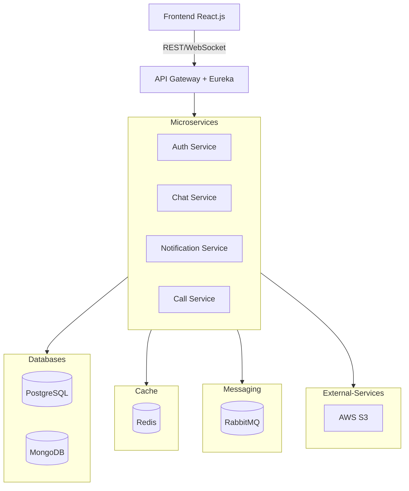

# Chatty

## Software Specification Document

**February 27, 2025**

**Authors:**  
Revazi Gelenidze | Murmani Akhaladze

**Contact:**  
📧 [gelenidze.revazi@kiu.edu.ge](mailto:gelenidze.revazi@kiu.edu.ge)  
📧 [akhaladze.murmani@kiu.edu.ge](mailto:akhaladze.murmani@kiu.edu.ge)

## Table of Contents

1. [Introduction](#introduction)
    - [1.1 Purpose](#11-purpose)
    - [1.2 Scope](#12-scope)
2. [System Overview](#system-overview)
    - [2.1 System Context](#21-system-context)
3. [Functional Requirements](#functional-requirements)
4. [Non-Functional Requirements](#non-functional-requirements)
5. [System Architecture](#system-architecture)
6. [API Design](#api-design)
7. [Message Queue](#message-queue)
8. [Deployment Strategy](#deployment-strategy)
9. [Appendix](#appendix)
    - [9.1 Definitions & Acronyms](#91-definitions--acronyms)
    - [9.2 References](#92-references)

---

## **1. Introduction**

**The goal** is to develop a **chat messaging web application**. The application is intended to be **publicly deployed**, allowing users to sign up and use it for **end-to-end (E2E) encrypted messaging and video/audio calls** as a **casual
chat application**.

### **1.1 Purpose**

The purpose of this document is to define the **technical and functional specifications** for the chat messaging web application. It serves as a **guideline for developers** to ensure proper implementation, scalability, and security with
a planned roadmap.

This document aims to:

- Define the **core functionalities** (messaging, video/audio calls, authentication).
- Provide a **detailed system architecture** with microservices, APIs, and database structures.
- Outline **security measures**, including **end-to-end encryption** for private communication.
- Specify the **non-functional requirements** such as performance, availability, and scalability.
- Detail the **deployment strategy** for **cloud hosting** and **CI/CD automation**.

### **1.2 Scope**

The chat application will provide the following core functionalities:

#### **User Authentication & Authorization**

- JWT-based authentication with **Google OAuth2 integration**.
- Secure account creation and login with **email verification**.

#### **Real-time Messaging**

- One-to-one and group chats with **end-to-end encryption (E2EE)**.
- Message persistence using **PostgreSQL (users) & MongoDB (messages)**.

#### **Voice & Video Calls**

- **WebRTC-based** peer-to-peer (P2P) and server-relayed calls.
- **Multi-user conference support**.

#### **Multimedia Sharing**

- Users can send **images, videos, and files** in chats.
- **Cloud-based media storage integration**.

#### **Notification System**

- **Push notifications** for new messages and call invites.
- **Email notifications** for user engagement.

---

## **2. System Overview**

### **2.1 System Context**

The chat application is a **publicly deployed, real-time messaging platform** that allows users to **communicate securely** using **E2E-encrypted messaging, voice, and video calls**. It operates in a **microservices architecture**, with independent services handling authentication, messaging, media storage, and notifications.

### 2.2 **High-Level Architecture**

As for decoupling responsibilities and making it scalable, chosen architecture style is **Microservices**. We have Primary mediator of Spring Cloud API Gateway, delegating requests to microservices connected via Eureka Service registration.

The system consists of:

- **React.js Frontend** – Provides the user interface for chat, calls, and notifications.
- **Spring Boot Backend** – Manages authentication, chat processing, and notification handling.
- **Databases:**
  - **PostgreSQL** – Stores user accounts and relationships.
  - **MongoDB** – Stores chat history and saved notifications.
- **RabbitMQ** – Handles asynchronous messaging for **emails & notifications.
- **Redis** – Caches frequently accessed and **“hot data”** to improve performance.

### **2.3 Core Components & Their Roles**

#### **Frontend: React.js App**
- Provides a responsive **UI** for using whole application.
- Communicates with the backend using **REST APIs** and **WebSockets** for real-time updates.

#### **Auth Service**
- Manages **JWT-based authentication** and **Google OAuth2 login**.
- Handles **user account management**, including **CRUD operations for user entities**.
- Interacts with **PostgreSQL** for storing user profiles and authentication data.

#### **Chat Service**
- Handles **real-time messaging, group chats, and chat management**.
- Directly interacts with **MongoDB** to store **chat messages and conversation history**.
- Supports **message encryption** for end-to-end security.

#### **Notification Service**
- Consumes messages from **RabbitMQ queues** to handle:
  - **Push notifications** for new messages and events via **WebSockets**.
  - **Email notifications** via **Google SMTP** for account-related actions.

#### **Call Service**
- Microservice responsible for **WebRTC-based audio/video calls** with **screen sharing**.
- Manages **peer-to-peer signaling** and **TURN/STUN server integration**.
- Ensures **secure and encrypted** communication using **DTLS-SRTP**.

#### **Databases**
- **PostgreSQL**
  - Contains two schemas:
    1. **Auth Service Schema** – Stores user authentication & profile data.
    2. **Chat Service Schema** – Manages **relational chat data** (friendships, requests, blocks).
  
- **MongoDB**
  - Stores two major collections:
    1. **Chat Service Collections** – Persists chat messages and conversation metadata.
    2. **Notification Service Collections** – Saves push/email notification logs.

#### **Cache: Redis**
- Caches **frequently accessed profile data** to reduce database queries.
- Stores **user online status** and **active session information** for real-time updates.

#### **Messaging: RabbitMQ**
- Manages **asynchronous messaging** with two queues:
  - **Email Queue** – Processes and sends user emails.
  - **Push Notification Queue** – Handles mobile and web push notifications.
#### **AWS S3**
- Cloud-based **file storage system** for:
  - **Chat attachments** (images, videos, files).
  - **Profile pictures** and other **user-uploaded media**.

# **3. Functional Requirements**

---
## **/FR1/ Authentication & Authorization**
**Description:** Users must be able to securely authenticate and authorize access to the system using **JWT-based authentication** or **Google OAuth2**.

### **/FR1.1/ User Registration**
**Description:** Users must be able to create an account with **email, username, password, and profile-related fields**.

- **Precondition:**  
  - Email and username **must be unique** (not used before).  
  - Fields must comply with **backend validation** (e.g., strong password policy).  

- **Postcondition:**  
  - User is stored in **PostgreSQL** with `isActive=false`.  
  - A **verification email** is sent.

---

### **/FR1.2/ User Login**
**Description:** Users must be able to log in using **email and password**.

- **Precondition:**  
  - User **must exist** in the database.  
  - User **must have verified their email** (`isActive=true`).  

- **Postcondition:**  
  - User receives a **JWT token** for authentication.  
  - Session details are cached in **Redis**.

- **Edge Case:**
	- If user is not activated, login is denied and verification email is sent.

---

### **/FR1.3/ Google OAuth2 Authentication**
**Description:** Users must be able to authenticate using **Google OAuth2**.

- **Precondition:**  
  - User must have a valid **Google account**.  

- **Postcondition:**  
  - OAuth2 token is forwarded to backend, exhaching it with user information with Google API.  
  - If user is recorded in database, JWT pair is returned for using website, else they redirect to the partial registration for providing additional profile info (username, dob, etc) 

---

### **/FR1.4/ JWT Management**
**Description:** JWT tokens must be issued, refreshed, and revoked securely.

- **Precondition:**  
  - User must be **authenticated**: Provide valid credentials for login and valid refresh for refreshing access token.  

- **Postcondition:**  
  - Access tokens have a **limited validity period**.  
  - Refresh tokens allow the user to obtain a **new access token**.

---

## **/FR2/ User Management**
**Description:** Users should be able to manage their **credentials and profile information**.

### **/FR2.1/ Password Reset**
- **Precondition:** User **requests a password reset**.  
- **Postcondition:** A **temporary URL with reset token** is emailed, allowing password change.

### **/FR2.2/ Access Profile Information**
- **Precondition:** User must be **logged in**.  
- **Postcondition:** User retrieves their **profile information**.

### **/FR2.3/ Profile Update**
- **Precondition:** User **submits updated profile data** (partial update is allowed).  
- **Postcondition:** Changes are **saved in PostgreSQL**.

### **/FR2.4/ User Deletion**
- **Precondition:** User **confirms deletion request**.  
- **Postcondition:** User data is removed from the database, but messages and interactions are persisted in chats with note that user is removed.

---

## **/FR3/ Chat Functionality**
**Description:** Users should be able to send and receive **messages in real-time**.

### **/FR3.1/ One-to-One Messaging**
- **Precondition:** Sender is connected via WebSocket to deliver message
- **Postcondition:** Message is **delivered via WebSockets** and **stored in MongoDB**.

### **/FR3.2/ Group Messaging**
- **Precondition:** User must be a **member of the group**.  
- **Postcondition:** Message is **broadcasted to all group members**.

### **/FR3.3/ Sending Media**
- **Precondition:** File size **must not exceed the allowed limit**.  
- **Postcondition:** File is **uploaded to AWS S3** and a reference is stored in MongoDB.

### **/FR3.4/ Users Presence and Status**
- **Precondition:** User **must be logged in**.  
- **Postcondition:** User’s **online status** is updated in **Redis**.

---

## **/FR4/ E2E Communication**
**Description:** Messages and calls must be **end-to-end encrypted (E2EE)**.

### **/FR4.1/ E2E Encrypted Messages**
- TODO: Use Signal Protocol

### **/FR4.2/ E2E Encrypted Calls**
- **Precondition:** WebRTC **session must be established**.  
- **Postcondition:** Audio/video streams are encrypted with **DTLS-SRTP**.

### **/FR4.3/ Key Management with Signal Protocol**
- **Precondition:** Each user must have a **unique key pair**.  
- **Postcondition:** Keys are stored **securely on the client-side**, never on the server.

---

## **/FR5/ Notifications**
**Description:** Users must receive **push and email notifications**.

- **Precondition:** User **must have notifications enabled**.  
- **Postcondition:** Notifications are delivered via **RabbitMQ & Firebase**.

---

## **/FR6/ Security & Privacy**
**Description:** The system must ensure **secure access control, logging, and monitoring**.

### **/FR6.1/ Rate Limiting**
- **Precondition:** User attempts to **make multiple API requests** in a short time.  
- **Postcondition:** **Excessive requests are blocked** (HTTP 429).

### **/FR6.2/ Logging & Monitoring**
- **Precondition:** User performs an action that needs tracking.  
- **Postcondition:** **Security logs** are stored.

---

## **/FR7/ Call Functionality**
**Description:** Users must be able to **make secure audio/video calls**.

### **/FR7.1/ Audio Call**
- **Precondition:** Both users must be **online**.  
- **Postcondition:** A **WebRTC peer connection** is established.

### **/FR7.2/ Video Call**
- **Precondition:** Users must **have a camera enabled**.  
- **Postcondition:** Video is streamed securely via **WebRTC**.

#### **/FR7.2.1/ Screen Sharing**
- **Precondition:** User selects a **window or screen** to share.  
- **Postcondition:** The selected **screen is streamed** over WebRTC.

### **/FR7.3/ Group Call**
- **Precondition:** User must be in a **group chat**.  
- **Postcondition:** WebRTC **multi-peer connection** is established.

## **4. Non-Functional Requirements**

## **5. System Architecture**

## **6. API Design**

## **7. Message Queue**

## **8. Deployment Strategy**

## **9. Appendix**

### **9.1 Definitions & Acronyms**

### **9.2 References**

