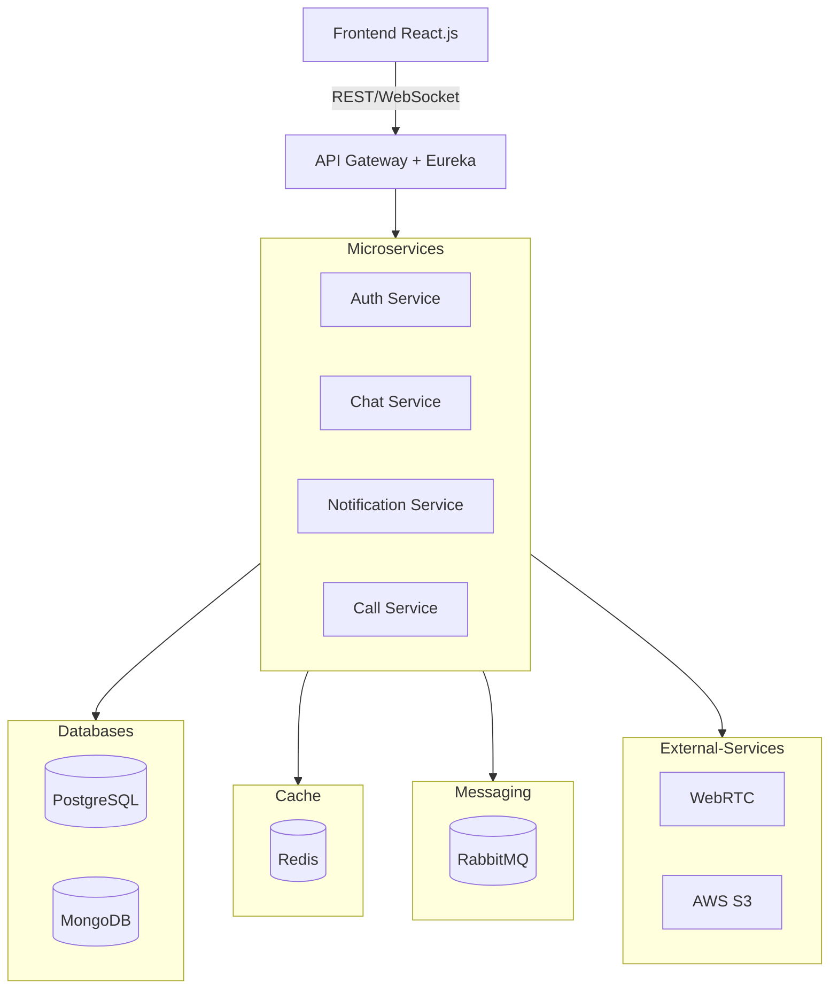

# Chatty

## Software Specification Document

**February 27, 2025**

**Authors:**  
Revazi Gelenidze | Murmani Akhaladze

**Contact:**  
📧 [gelenidze.revazi@kiu.edu.ge](mailto:gelenidze.revazi@kiu.edu.ge)  
📧 [akhaladze.murmani@kiu.edu.ge](mailto:akhaladze.murmani@kiu.edu.ge)

## Table of Contents

1. [Introduction](#introduction)
    - [1.1 Purpose](#11-purpose)
    - [1.2 Scope](#12-scope)
2. [System Overview](#system-overview)
    - [2.1 System Context](#21-system-context)
3. [Functional Requirements](#functional-requirements)
4. [Non-Functional Requirements](#non-functional-requirements)
5. [System Architecture](#system-architecture)
6. [API Design](#api-design)
7. [Message Queue](#message-queue)
8. [Deployment Strategy](#deployment-strategy)
9. [Appendix](#appendix)
    - [9.1 Definitions & Acronyms](#91-definitions--acronyms)
    - [9.2 References](#92-references)

---

## **1. Introduction**

The goal is to develop a **chat messaging web application**. The application is intended to be **publicly deployed**,
allowing users to sign up and use it for **end-to-end (E2E) encrypted messaging and video/audio calls** as a **casual
chat application**.

### **1.1 Purpose**

The purpose of this document is to define the **technical and functional specifications** for the chat messaging web
application. It serves as a **guideline for developers** to ensure proper implementation, scalability, and security with
a planned roadmap.

This document aims to:

- Define the **core functionalities** (messaging, video/audio calls, authentication).
- Provide a **detailed system architecture** with microservices, APIs, and database structures.
- Outline **security measures**, including **end-to-end encryption** for private communication.
- Specify the **non-functional requirements** such as performance, availability, and scalability.
- Detail the **deployment strategy** for **cloud hosting** and **CI/CD automation**.

### **1.2 Scope**

The chat application will provide the following core functionalities:

#### **User Authentication & Authorization**

- JWT-based authentication with **Google OAuth2 integration**.
- Secure account creation and login with **email verification**.

#### **Real-time Messaging**

- One-to-one and group chats with **end-to-end encryption (E2EE)**.
- Message persistence using **PostgreSQL (users) & MongoDB (messages)**.

#### **Voice & Video Calls**

- **WebRTC-based** peer-to-peer (P2P) and server-relayed calls.
- **Multi-user conference support**.

#### **Multimedia Sharing**

- Users can send **images, videos, and files** in chats.
- **Cloud-based media storage integration**.

#### **Notification System**

- **Push notifications** for new messages and call invites.
- **Email notifications** for user engagement.

---

## **2. System Overview**

### **2.1 System Context**

The chat application is a **publicly deployed, real-time messaging platform** that allows users to **communicate
securely** using **E2E-encrypted messaging, voice, and video calls**. It operates in a **microservices architecture**,
with independent services handling authentication, messaging, media storage, and notifications.

## **3. Functional Requirements**

## **4. Non-Functional Requirements**

## **5. System Architecture**

## **6. API Design**

## **7. Message Queue**

## **8. Deployment Strategy**

## **9. Appendix**

### **9.1 Definitions & Acronyms**

### **9.2 References**

